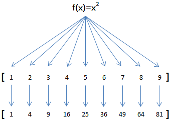

# 高阶函数

高阶函数英文叫Higher-order function。那么什么是高阶函数？

JavaScript的函数其实都指向某个变量。既然变量可以指向函数，函数的参数能接收变量，那么一个函数就可以接收另一个函数作为参数，这种函数就称之为高阶函数。

一个最简单的高阶函数：
```javascript
function add(x, y, f) {
    return f(x) + f(y);
}
```
当我们调用`add(-5, 6, Math.abs)`时，参数`x，y`和`f`分别接收`-5，6`和函数`Math.abs`，根据函数定义，我们可以推导计算过程为：

```javascript
x = -5;
y = 6;
f = Math.abs;
f(x) + f(y) ==> Math.abs(-5) + Math.abs(6) ==> 11;
return 11;
```
用代码验证一下：

```javascript
add(-5, 6, Math.abs); // 11
```
编写高阶函数，就是让函数的参数能够接收别的函数。

## map/reduce

如果你读过Google的那篇大名鼎鼎的论文`“MapReduce: Simplified Data Processing on Large Clusters”`，你就能大概明白`map/reduce`的概念。
### map

举例说明，比如我们有一个函数`f(x)=x2`，要把这个函数作用在一个数组`[1, 2, 3, 4, 5, 6, 7, 8, 9]`上，就可以用map实现如下：



由于`map()`方法定义在JavaScript的`Array`中，我们调用`Array`的`map()`方法，传入我们自己的函数，就得到了一个新的Array作为结果：

```javascript
function pow(x) {
    return x * x;
}

var arr = [1, 2, 3, 4, 5, 6, 7, 8, 9];
arr.map(pow); // [1, 4, 9, 16, 25, 36, 49, 64, 81]
```

`map()`传入的参数是`pow`，即函数对象本身。

你可能会想，不需要`map()`，写一个循环，也可以计算出结果：

```javascript
var f = function (x) {
    return x * x;
};

var arr = [1, 2, 3, 4, 5, 6, 7, 8, 9];
var result = [];
for (var i=0; i<arr.length; i++) {
    result.push(f(arr[i]));
}
```
的确可以，但是，从上面的循环代码，我们无法一眼看明白“把f(x)作用在Array的每一个元素并把结果生成一个新的Array”。

所以，`map()`作为高阶函数，事实上它把运算规则抽象了，因此，我们不但可以计算简单的`f(x)=x2`，还可以计算任意复杂的函数，比如，把Array的所有数字转为字符串：

```javascript
var arr = [1, 2, 3, 4, 5, 6, 7, 8, 9];
arr.map(String); // ['1', '2', '3', '4', '5', '6', '7', '8', '9']
```
只需要一行代码。

### reduce

再看reduce的用法。Array的`reduce()`把一个函数作用在这个Array的`[x1, x2, x3...]`上，这个函数必须接收两个参数，reduce()把结果继续和序列的下一个元素做累积计算，其效果就是：

`[x1, x2, x3, x4].reduce(f) = f(f(f(x1, x2), x3), x4)`
比方说对一个Array求和，就可以用reduce实现：

```javascript
var arr = [1, 3, 5, 7, 9];
arr.reduce(function (x, y) {
    return x + y;
}); // 25
```

要把`[1, 3, 5, 7, 9]`变换成整数13579，`reduce()`也能派上用场：

```javascript
    var arr = [1, 3, 5, 7, 9];
    arr.reduce(function (x, y) {
        return x * 10 + y;
    }); // 13579
```

如果我们继续改进这个例子，想办法把一个字符串13579先变成Array——[1, 3, 5, 7, 9]，再利用reduce()就可以写出一个把字符串转换为Number的函数

练习：
1. 不要使用JavaScript内置的parseInt()函数，利用map和reduce操作实现一个string2int()函数：
2. 请把用户输入的不规范的英文名字，变为首字母大写，其他小写的规范名字。输入：['adam', 'LISA', 'barT']，输出：['Adam', 'Lisa', 'Bart']。
3. 小明希望利用map()把字符串变成整数，他写的代码很简洁：结果竟然是[1, NaN, NaN]，小明百思不得其解，请帮他找到原因并修正代码。

## filter

`filter`也是一个常用的操作，它用于把Array的某些元素过滤掉，然后返回剩下的元素。

和`map()`类似，Array的`filter()`也接收一个函数。和`map()`不同的是，`filter()`把传入的函数依次作用于每个元素，然后根据返回值是true还是false决定保留还是丢弃该元素。

例如，在一个Array中，删掉偶数，只保留奇数，可以这么写：

```javascript
var arr = [1, 2, 4, 5, 6, 9, 10, 15];
var r = arr.filter(function (x) {
    return x % 2 !== 0;
});
r; // [1, 5, 9, 15]
```
把一个Array中的空字符串删掉，可以这么写：

```javascript
var arr = ['A', '', 'B', null, undefined, 'C', '  '];
var r = arr.filter(function (s) {
    return s && s.trim(); // 注意：IE9以下的版本没有trim()方法
});
r; // ['A', 'B', 'C']
```
可见用`filter()`这个高阶函数，关键在于正确实现一个“筛选”函数。

回调函数

filter()接收的回调函数，其实可以有多个参数。通常我们仅使用第一个参数，表示Array的某个元素。回调函数还可以接收另外两个参数，表示元素的位置和数组本身：

```javascript
var arr = ['A', 'B', 'C'];
var r = arr.filter(function (element, index, self) {
    console.log(element); // 依次打印'A', 'B', 'C'
    console.log(index); // 依次打印0, 1, 2
    console.log(self); // self就是变量arr
    return true;
});
```
利用filter，可以巧妙地去除Array的重复元素：

```javascript
'use strict';
var
    r,
    arr = ['apple', 'strawberry', 'banana', 'pear', 'apple', 'orange', 'orange', 'strawberry'];
    r = arr.filter(function (element, index, self) {
        return self.indexOf(element) === index;
    });
alert(r.toString());

```

去除重复元素依靠的是`indexOf`总是返回第一个元素的位置，后续的重复元素位置与indexOf返回的位置不相等，因此被filter滤掉了。

请尝试用filter()筛选出素数：

```javascript

'use strict';

function get_primes(arr) {
        return [];
}

// 测试:
var
    x,
    r,
    arr = [];
for (x = 1; x < 100; x++) {
    arr.push(x);
}
r = get_primes(arr);
if (r.toString() === [2, 3, 5, 7, 11, 13, 17, 19, 23, 29, 31, 37, 41, 43, 47, 53, 59, 61, 67, 71, 73, 79, 83, 89, 97].toString()) {
    alert('测试通过!');
} else {
    alert('测试失败: ' + r.toString());
}
```